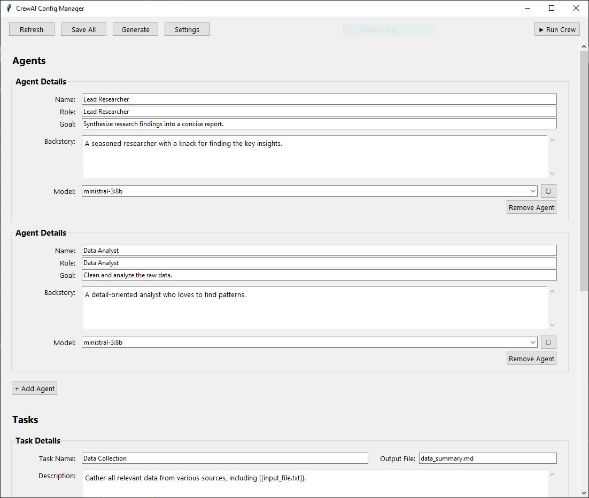

# CrewAI GUI & Automation System



## Overview
An advanced automation system for managing and executing CrewAI agent teams. This application provides a powerful graphical interface for creating, configuring, and running AI agent crews with support for multiple architectures, intelligent task generation, and dynamic file processing.

## Key Features

✨ **Multi-Crew Management** - Create and manage multiple independent crew configurations  
🤖 **AI-Powered Generation** - Meta-agents automatically design optimal team structures  
📝 **Enhanced Task Descriptions** - AI expands brief requests into detailed specifications  
🏗️ **Multiple Architectures** - Sequential and Hierarchical workflows with optional Supervisor  
🔧 **Tool Agent Support** - Centralized external operations (web search, file reading)  
🎯 **Smart File Injection** - Dynamic content loading with automatic sampling for large files  
📊 **Real-time Monitoring** - Live execution logs with progress indicators  
🔄 **Iterative Refinement** - Improve crews based on feedback  
💾 **Intelligent Output Routing** - Automatic or custom file naming for task results  

## Quick Start

### Prerequisites
- **Python 3.8+**
- **Ollama** - Local LLM server ([Download](https://ollama.com/))

### Installation

1. **Install Ollama and pull a model:**
   ```bash
   ollama pull ministral-3:8b
   ```

2. **Create and activate virtual environment:**
   
   **Windows:**
   ```powershell
   python -m venv venv
   .\venv\Scripts\activate
   ```
   
   **Linux / macOS:**
   ```bash
   python -m venv venv
   source venv/bin/activate
   ```

3. **Install dependencies:**
   ```bash
   pip install -r requirements.txt
   ```

4. **Launch the application:**
   ```bash
   python app.py
   ```

### First-Time Setup

1. Click **Settings** in the menu bar
2. Configure your Ollama server:
   - **OLLAMA_SERVER**: `localhost` (default)
   - **OLLAMA_PORT**: `11434` (default)
   - **OLLAMA_MODEL**: Your preferred model (e.g., `ministral-3:8b`)
3. Click **Save Settings**

## Usage Guide

### Creating Your First Crew

1. **Create a new crew:**
   - Click **"+ New"** in the toolbar
   - Enter a name (e.g., "Content Writer")
   - Add a brief description
   - Click **Create**

2. **Generate the crew:**
   - Click **"Generate"** button
   - Describe your task (e.g., "Write blog posts about AI")
   - Choose architecture:
     - **Sequential**: Tasks run in order (recommended for beginners)
     - **Hierarchical**: Supervisor coordinates work
   - Optional: Enable **Supervisor** for quality control
   - Optional: Enable **Tool Agent** for web research
   - Click **"Generate Crew"**

3. **Review and customize:**
   - The AI will create agents and tasks automatically
   - Review the generated configuration in the main window
   - Edit agents or tasks if needed
   - Click **"Save"** to persist changes

4. **Run the crew:**
   - Click **"Run Crew"** button
   - Monitor progress in the execution log window
   - Find results in `crews/[YourCrewName]/output/`

### Working with Files

**Input Files:**
Place files you want the crew to process in:
```
crews/[YourCrewName]/input/
```

**Reference files in tasks using:**
```markdown
[[filename.txt]]
```

The system will automatically inject the file content.

**Output Files:**
All crew outputs are saved to:
```
crews/[YourCrewName]/output/
```

### Refining a Crew

1. Click **"Generate"** button
2. Switch to the **"Feedback / Refinement"** section
3. Describe what you want to change (e.g., "Add a proofreading agent")
4. Click **"Refine Crew"**
5. The AI will update your crew configuration

## Architecture Modes

### Sequential (Default)
Tasks execute one after another. Simple and reliable.
```
Task 1 → Task 2 → Task 3 → Done
```

### Hierarchical
A supervisor coordinates and reviews all work.
```
        Supervisor
           ↓
    ┌──────┼──────┐
    ↓      ↓      ↓
  Agent1 Agent2 Agent3
```

### With Supervisor Mode
Adds quality gates where supervisor can approve or request revisions.

### With Tool Agent
One agent handles all external operations (searches, file reading), preventing duplicate work.

## Advanced Features

### Enhanced Task Generation
When you type a brief task like:
```
Generate passive income ideas
```

The AI automatically expands it into a detailed specification:
```
Research and generate a comprehensive list of passive income 
opportunities suitable for different skill levels and initial 
investment ranges. Include analysis of required time commitment, 
startup costs, scalability potential, and expected ROI...
```

### Smart File Sampling
Large files (>50KB) are automatically sampled to prevent context overflow:
- First 15KB
- Middle 15KB  
- Last 15KB

### Custom Output Files
Specify where task results should be saved:
```markdown
### Write Article [Output: article.md]
```

### Model Selection
Assign different models to different agents:
- Fast models for simple tasks
- Powerful models for complex reasoning
- Specialized models for specific domains

## Configuration Reference

### Environment Variables (.env)
```bash
OLLAMA_SERVER=localhost          # Ollama server address
OLLAMA_PORT=11434               # Ollama server port
OLLAMA_MODEL=ministral-3:8b     # Default model for agents
OPENAI_API_KEY=                 # Optional: for OpenAI tools
OTEL_SDK_DISABLED=true          # Disable telemetry
PYTHON_VENV_PATH=./venv         # Path to virtual environment
```

### Crew Structure
Each crew folder contains:
```
crews/MyCrewName/
├── Crew.md          # Agent and task definitions
├── Task.md          # Enhanced task description
├── crew.json        # Metadata
├── input/           # Files for processing
└── output/          # Generated results
```

## Troubleshooting

### Model Not Found
```bash
# List available models
ollama list

# Pull a model if missing
ollama pull ministral-3:8b
```

### Connection Refused
```bash
# Check if Ollama is running
ollama serve
```

### Empty or Incorrect Output
- Verify your task description is clear
- Check that the correct model is selected
- Review execution logs for errors
- Try a more powerful model for complex tasks

## Tips for Best Results

1. **Be specific in task descriptions** - The more detail you provide, the better the results
2. **Use appropriate models** - Match model capability to task complexity
3. **Start simple** - Test with sequential architecture before trying hierarchical
4. **Iterate** - Use the Refine feature to improve crews based on results
5. **Organize files** - Keep input files in the crew's input/ directory
6. **Review logs** - Check execution logs to understand agent reasoning

## Project Structure

```
crewAI/
├── app.py                    # Main GUI application
├── requirements.txt          # Python dependencies
├── .env                      # Configuration
├── README.md                 # This file
├── Project_Specs.md          # Technical documentation
├── crews/                    # Crew configurations
│   ├── default/
│   ├── Idea Creator/
│   └── ...
└── script/                   # Core scripts
    ├── create_crew.py        # Meta-agent generation
    ├── run_crew.py           # Execution engine
    ├── tools_registry.py     # Tools management
    └── examples/             # Reference files
```

## Learn More

- **Project_Specs.md** - Detailed technical documentation
- **script/examples/** - Example configurations
- **CrewAI Documentation** - [docs.crewai.com](https://docs.crewai.com)
- **Ollama Models** - [ollama.com/library](https://ollama.com/library)

## Support

For issues or questions:
1. Check the Troubleshooting section
2. Review execution logs for error details
3. Verify configuration in Settings
4. Test with a simple crew first

---

**Happy automating! 🚀**
